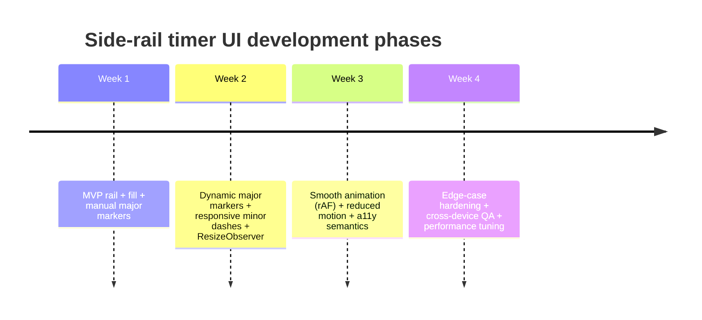

# Responsive Side-Rail Timer UI Implementation Guide

## Executive summary

A responsive side-rail timer is effectively a **vertical axis** whose semantics are “time remaining”, with (a) a **background fill** that shrinks as time elapses, (b) **major ticks** that are **numbered checkpoints** (e.g., 25, 20, 15…), and (c) **minor ticks** that are **unlabelled dashes** used purely to improve scan-ability and convey continuity. The most robust way to generate major tick labels from arbitrary total time **T** is to borrow “nice tick” logic from charting (e.g., 1–2–5 × powers of 10) and/or time-aware intervals (e.g., 1/5/15/30 seconds or minutes), as used by mainstream frontend visualisation tooling. citeturn0search0turn2search2turn12view0turn15search0

Two implementation decisions determine difficulty and quality:
1) **Tick generation**: “nice” major markers must remain human-friendly even for awkward totals (e.g., 13 mins), while keeping label count bounded. This is a solved problem in chart axes (Heckbert; D3 tick logic; extended Wilkinson variants), and you can apply the same principles to a countdown rail. citeturn12view0turn0search0turn7view0  
2) **Responsiveness**: minor dashes should be driven by **pixel space**, not by time units. That means you measure the pixel gap between adjacent major markers and insert as many minor dashes as fit given a minimum spacing threshold, recalculating on resize. Using `ResizeObserver` is the modern, element-centric approach. citeturn1search0turn1search4

A recommended baseline architecture is:
- **Timekeeping** uses a monotonic clock (`performance.now`) so the timer remains accurate even if rendering is throttled or delayed. citeturn14search0turn14search11  
- **Rendering** updates a single transformed element (e.g., `scaleY`) for performance; `requestAnimationFrame` is preferred for smooth animation, while a low-frequency update + CSS transitions is a good battery-friendly alternative. citeturn0search3turn0search11turn0search15  
- **Accessibility** provides a numeric fallback (e.g., `role="timer"` or `role="progressbar"` + `aria-valuetext`), ensures text/background contrast meets WCAG, and respects reduced-motion preferences. citeturn13search0turn1search2turn1search10turn1search3turn1search5

Prioritised deliverables (basic → flexible → polished):
- **Basic**: static major markers (manual), fixed minor dashes, fill shrink, accurate countdown.  
- **Flexible**: dynamic major-marker generation from arbitrary T; responsive minor-dash density; resize-safe layout.  
- **Polished**: smooth animation; reduced-motion mode; active-zone emphasis; robust a11y semantics; background-tab throttling resilience and visibility handling. citeturn3search0turn3search2turn2search0

## Key requirements and UX rules

Functional requirements:
- The instruction content remains the primary visual focus; the rail is peripheral and should not compete with the centre content.
- The rail communicates **time remaining** via position (ticks) and motion (shrinking fill), not via a large clock widget.
- The system supports arbitrary total duration **T** (e.g., 13 minutes) with labels that remain easy to count down from.

UX rules (high-signal rules that prevent “clever UI” from becoming confusing):
- **Major vs minor semantics**: numbered major ticks are “meaningful checkpoints”; minor dashes are “visual rhythm”. If minor dashes are responsive (vary by screen height), they must be visually subordinate so users do not infer that each minor dash equals a fixed time unit. (This is the same separation chart axes make between major and minor ticks.) citeturn7view0turn15search0
- **Label density guardrails**: cap the number of major labels based on available height; prevent label overlap by enforcing a minimum “label-to-label” spacing in pixels (and dropping intermediate labels first if necessary). The extended Wilkinson approach explicitly treats legibility and density as optimisation criteria; you can apply the spirit of that without implementing the full optimisation. citeturn7view0
- **Readability over moving colour**: if the fill is bright or changes hue, use a scrim or background panel behind the instruction text so text contrast remains stable. WCAG’s contrast minimum for body text is commonly interpreted as 4.5:1 (with exceptions for large text). citeturn1search3turn1search7
- **Reduced motion**: the timer should still be understandable if motion is reduced—e.g., switch from smooth continuous shrink to stepped updates or eliminate animation transitions when `prefers-reduced-motion` is set. citeturn1search5turn1search1
- **Time-friendly increments**: for seconds/minutes/hours, choose increments humans recognise (e.g., 5/15/30 minutes). D3 time scales explicitly enumerate these as candidate tick intervals because time is irregular and “nice” increments differ from pure 1–2–5 numeric ticks. citeturn15search0turn15search4

## Algorithms for major numbered markers and responsive minor dashes

### Major markers from arbitrary total time T

You have two proven families of approaches. Both are chart-axis techniques; choose based on whether your T is treated as a **generic number** or a **time duration**.

Approach A: numeric “nice ticks” (Heckbert / D3-style 1–2–5)
- D3’s tick system produces “nicely-rounded” values where the step is a power of ten multiplied by 1, 2, or 5. citeturn0search0turn2search2
- Heckbert’s “Nice Numbers for Graph Labels” computes a “nice” range and spacing using a helper `nicenum`, then expands to `graphmin`/`graphmax` based on the spacing. In the reference C code: `range = nicenum(max-min, 0)` and `d = nicenum(range/(NTICK-1), 1)` before flooring/ceiling the min/max to multiples of `d`. citeturn12view0

How to adapt to a countdown rail:
- Use domain `[0, T]` (time remaining).
- Compute a nice step size `d`.
- Generate interior major ticks at multiples of `d` inside `[0, T]`.
- Always include `T` (top marker) and `0` (bottom marker), even when `T` is not a multiple of `d`.  
This yields “awkward totals become easy”: e.g., `T=13` with `d=5` gives markers `{13, 10, 5, 0}`.

Approach B: time-aware “nice intervals” (D3 time-scale intervals)
D3 time scales consider specific tick intervals such as 1/5/15/30 seconds, 1/5/15/30 minutes, 1/3/6/12 hours, etc., for automatic ticks. citeturn15search0turn15search4  
Even though your timer is not a date axis, these increments match human expectations for durations and avoid oddities like “1000 seconds” when you really want “15 minutes”.

Recommended hybrid strategy (best in practice):
- Choose a **target major tick count** based on available height.
- Try time-aware candidate steps first (if T is in seconds/minutes/hours).
- Fall back to numeric 1–2–5 steps for unusual ranges.

#### Pseudocode: “nice” major markers

```js
// Units: seconds (can be minutes/hours; keep internal in seconds for simplicity).

function clamp(n, lo, hi) { return Math.max(lo, Math.min(hi, n)); }

function chooseTargetMajorCount(trackHeightPx, minMajorGapPx) {
  // +1 because N labels create N-1 gaps.
  return clamp(Math.floor(trackHeightPx / minMajorGapPx) + 1, 2, 9);
}

// Heckbert-style nicenum: returns 1,2,5,10 * 10^k depending on rounding mode.
function niceNum(x, round) {
  if (x <= 0) return 1;
  const exp = Math.floor(Math.log10(x));
  const f = x / Math.pow(10, exp); // fraction 1..10
  let nf;
  if (round) {
    if (f < 1.5) nf = 1;
    else if (f < 3) nf = 2;
    else if (f < 7) nf = 5;
    else nf = 10;
  } else {
    if (f <= 1) nf = 1;
    else if (f <= 2) nf = 2;
    else if (f <= 5) nf = 5;
    else nf = 10;
  }
  return nf * Math.pow(10, exp);
}

function pickStepSeconds(T, targetCount) {
  // Prefer time-aware intervals (in seconds), inspired by D3 time-scale candidates.
  const candidates = [
    1, 5, 15, 30,
    60, 5*60, 15*60, 30*60,
    60*60, 3*60*60, 6*60*60, 12*60*60,
  ];

  const ideal = T / Math.max(1, (targetCount - 1));

  // Choose candidate closest to ideal, with a hard cap so we don't exceed target too much.
  let best = null;
  let bestScore = Infinity;

  for (const step of candidates) {
    const count = Math.floor(T / step) + 1; // includes 0
    // penalise too many labels heavily (legibility)
    const score = (count > targetCount ? 10_000 : 0) + Math.abs(step - ideal);
    if (score < bestScore) { bestScore = score; best = step; }
  }

  // If no time-aware candidate fits, fall back to numeric nice step.
  if (!best) return niceNum(ideal, true);
  return best;
}

function generateMajorValuesSeconds(T, trackHeightPx, config) {
  const minMajorGapPx = config.minMajorGapPx ?? 72;
  const targetCount = chooseTargetMajorCount(trackHeightPx, minMajorGapPx);

  const step = pickStepSeconds(T, targetCount);

  const values = new Set();
  values.add(0);
  values.add(T);

  // Multiples of step (descending or ascending doesn't matter; we'll sort later).
  for (let v = 0; v <= T; v += step) values.add(v);

  // Return descending (top → bottom): T ... 0
  return Array.from(values).sort((a, b) => b - a);
}
```

Why this is justified by primary sources: the step selection mirrors well-established axis tick rules (Heckbert nicenum; D3’s “power of ten multiplied by 1,2,5”; D3 time scales’ explicit candidate time intervals). citeturn12view0turn0search0turn2search2turn15search0

### Responsive minor dashes based on pixel gap

Goal: for each adjacent pair of major ticks, insert *as many minor dashes as fit*, without crowding.

Core idea:
- Determine pixel positions of major ticks.
- For each segment between major ticks, compute `gapPx`.
- Compute `minorCount = floor(gapPx / minMinorGapPx) - 1`, clamped to `[0, maxMinorPerSegment]`.
- Place minor dashes uniformly in that segment.

#### Pseudocode: minor dashes from gap

```js
function computeMinorTicks(yA, yB, config) {
  const minMinorGapPx = config.minMinorGapPx ?? 14;
  const maxMinorPerSegment = config.maxMinorPerSegment ?? 12;

  const top = Math.min(yA, yB);
  const bot = Math.max(yA, yB);
  const gap = bot - top;

  // Subtract 1 because minors go BETWEEN majors.
  const count = clamp(Math.floor(gap / minMinorGapPx) - 1, 0, maxMinorPerSegment);

  const ys = [];
  for (let i = 1; i <= count; i++) {
    ys.push(top + (gap * i) / (count + 1));
  }
  return ys;
}
```

This is the same spacing constraint chart axes typically apply (avoid overlap by enforcing a minimum pixel spacing), but expressed per segment because your top label is forced to be exactly T and may not align to a uniform tick grid. citeturn7view0turn1search0

## Layout, positioning math, rendering, and animation strategies

### Reference layout model

- The rail is a right-aligned, full-height container.
- The fill is a single element behind the content, shrinking vertically.
- Ticks are absolutely positioned layers above the fill.

#### Illustrative diagram (inline SVG mockup)

```html
<svg width="320" height="420" viewBox="0 0 320 420" xmlns="http://www.w3.org/2000/svg">
  <!-- background -->
  <rect x="0" y="0" width="320" height="420" fill="#111"/>
  <!-- fill (remaining) -->
  <rect x="0" y="0" width="320" height="260" fill="#2ecc71" opacity="0.85"/>
  <!-- instruction panel -->
  <rect x="20" y="120" width="200" height="140" fill="rgba(0,0,0,0.45)" rx="14"/>
  <text x="40" y="160" fill="#fff" font-size="14" font-family="system-ui">Instruction text lives here</text>
  <text x="40" y="185" fill="#fff" font-size="14" font-family="system-ui">Timer is peripheral</text>
  <!-- rail -->
  <rect x="270" y="20" width="2" height="380" fill="#fff" opacity="0.6"/>
  <!-- major ticks + labels -->
  <g fill="#fff" font-family="system-ui" font-size="12" opacity="0.9">
    <line x1="270" y1="20" x2="300" y2="20" stroke="#fff" stroke-width="2"/>
    <text x="305" y="24">25</text>

    <line x1="270" y1="120" x2="296" y2="120" stroke="#fff" stroke-width="2"/>
    <text x="305" y="124">20</text>

    <line x1="270" y1="220" x2="296" y2="220" stroke="#fff" stroke-width="2"/>
    <text x="305" y="224">15</text>

    <line x1="270" y1="320" x2="296" y2="320" stroke="#fff" stroke-width="2"/>
    <text x="305" y="324">10</text>

    <line x1="270" y1="400" x2="300" y2="400" stroke="#fff" stroke-width="2"/>
    <text x="305" y="404">0</text>
  </g>
  <!-- minor ticks (short, lighter) -->
  <g opacity="0.35" stroke="#fff" stroke-width="1">
    <line x1="270" y1="70" x2="286" y2="70"/>
    <line x1="270" y1="95" x2="286" y2="95"/>
    <line x1="270" y1="170" x2="286" y2="170"/>
    <line x1="270" y1="195" x2="286" y2="195"/>
    <line x1="270" y1="270" x2="286" y2="270"/>
    <line x1="270" y1="295" x2="286" y2="295"/>
    <line x1="270" y1="350" x2="286" y2="350"/>
    <line x1="270" y1="375" x2="286" y2="375"/>
  </g>
</svg>
```

### Positioning math

Assume:
- total time `T` (seconds)
- time remaining `r` (seconds)
- track height `H` (pixels)
- track top offset `topPad` (pixels)

Then:
- **progress ratio** (remaining): `p = r / T`
- **fill** shrinks with `scaleY(p)` (or height = `p * H`)
- **a tick at value v seconds remaining** is positioned at:

`yPx = topPad + (1 - v/T) * H`

So `v=T` (start) maps to top, and `v=0` maps to bottom.

This matches the mental model of a countdown axis (values decrease as you go down). It also decouples “semantic value” (seconds remaining) from layout (pixels). citeturn0search0turn12view0

### Core DOM structure and CSS

HTML:

```html
<div class="screen">
  <div class="timer-fill" id="timerFill" aria-hidden="true"></div>

  <div class="timer-rail" id="timerRail">
    <div class="ticks" id="ticksLayer"></div>
  </div>

  <main class="content">
    <h1>Instruction Title</h1>
    <p>Instruction text…</p>
  </main>

  <!-- a11y/numeric fallback (optional; see accessibility section) -->
  <div class="sr-only" id="timerA11y"></div>
</div>
```

CSS (core pieces):

```css
:root{
  --rail-width: 64px;
  --rail-pad-y: 16px;

  --major-tick-len: 26px;
  --minor-tick-len: 14px;

  --major-tick-thickness: 2px;
  --minor-tick-thickness: 1px;

  --label-size: 12px;
  --label-opacity: 0.9;

  --fill-opacity: 0.85;

  --tick-colour: rgba(255,255,255,0.85);
  --tick-muted: rgba(255,255,255,0.35);

  --scrim-bg: rgba(0,0,0,0.45);
}

.screen{
  position: relative;
  height: 100vh;
  overflow: hidden;
  background: #111;
}

.timer-fill{
  position: absolute;
  inset: 0;
  background: #2ecc71;
  opacity: var(--fill-opacity);
  transform-origin: top;
  transform: scaleY(1); /* driven by JS */
}

.timer-rail{
  position: absolute;
  top: 0;
  right: 0;
  width: var(--rail-width);
  height: 100%;
  pointer-events: none;
}

.ticks{
  position: absolute;
  top: var(--rail-pad-y);
  bottom: var(--rail-pad-y);
  left: 0;
  right: 0;
}

.tick{
  position: absolute;
  right: 8px;
  transform: translateY(-50%);
  display: flex;
  align-items: center;
  gap: 8px;
  white-space: nowrap;
  color: var(--tick-colour);
  font-size: var(--label-size);
  opacity: var(--label-opacity);
}

.tick .line{
  height: 0;
  border-top: var(--major-tick-thickness) solid var(--tick-colour);
  width: var(--major-tick-len);
}

.minor{
  position: absolute;
  right: 8px;
  transform: translateY(-50%);
  height: 0;
  border-top: var(--minor-tick-thickness) solid var(--tick-muted);
  width: var(--minor-tick-len);
}

.content{
  position: relative;
  z-index: 2;
  max-width: 720px;
  margin: 0 auto;
  padding: 96px 24px;
  color: #fff;
}

.content::before{
  content:"";
  position:absolute;
  inset: 72px 0 auto 0;
  height: calc(100% - 144px);
  background: var(--scrim-bg);
  filter: saturate(0.9);
  border-radius: 16px;
  z-index: -1;
}

.sr-only{
  position: absolute;
  width: 1px;
  height: 1px;
  padding: 0;
  margin: -1px;
  overflow: hidden;
  clip: rect(0, 0, 0, 0);
  white-space: nowrap;
  border: 0;
}
```

CSS custom properties are a good fit here because they support theming and runtime adjustments while participating in the cascade. citeturn2search3

### Rendering (markers + fill) in plain JS

Key implementation choices:
- Use `ResizeObserver` to recalc tick positions and minor densities when the rail size changes. citeturn1search0turn1search4
- Keep animation work minimal: update the fill with a transform; rebuild ticks only on resize or when T changes.

Marker rendering snippet:

```js
function formatLabelSeconds(vSec) {
  // For major markers, simple rounding is OK (they’re checkpoints).
  const sec = Math.round(vSec);

  // Make minutes the default for >= 60s, but keep a compact style.
  if (sec >= 3600) {
    const h = Math.floor(sec / 3600);
    const m = Math.floor((sec % 3600) / 60);
    return m ? `${h}h ${m}m` : `${h}h`;
  }
  if (sec >= 60) {
    const m = Math.floor(sec / 60);
    const s = sec % 60;
    return s ? `${m}:${String(s).padStart(2, "0")}` : `${m}m`;
  }
  return `${sec}s`;
}

function valueToYPx(vSec, T, trackTopPx, trackHeightPx) {
  const t = clamp(vSec / T, 0, 1);
  return trackTopPx + (1 - t) * trackHeightPx;
}

function renderTicks({ ticksLayer, majorValues, T, trackTopPx, trackHeightPx, config }) {
  const frag = document.createDocumentFragment();

  // Precompute major Y positions.
  const majorYs = majorValues.map(v => ({
    v,
    y: valueToYPx(v, T, trackTopPx, trackHeightPx),
  }));

  // Major ticks
  for (const { v, y } of majorYs) {
    const el = document.createElement("div");
    el.className = "tick";
    el.style.top = `${y}px`;

    const line = document.createElement("span");
    line.className = "line";

    const label = document.createElement("span");
    label.className = "label";
    label.textContent = formatLabelSeconds(v);

    el.append(line, label);
    frag.appendChild(el);
  }

  // Minor ticks between major ticks
  for (let i = 0; i < majorYs.length - 1; i++) {
    const yA = majorYs[i].y;
    const yB = majorYs[i + 1].y;
    const minorYs = computeMinorTicks(yA, yB, config);
    for (const y of minorYs) {
      const el = document.createElement("div");
      el.className = "minor";
      el.style.top = `${y}px`;
      frag.appendChild(el);
    }
  }

  ticksLayer.replaceChildren(frag);
}
```

### Animation strategies

Option A (smoothest): `requestAnimationFrame` + monotonic elapsed time  
`requestAnimationFrame` schedules work before the browser’s next repaint and is widely recommended over `setInterval`/`setTimeout` loops for animation performance and efficiency. citeturn0search11turn0search3turn0search15  
Use `performance.now()` to compute elapsed time precisely from a start timestamp; it is monotonic and not subject to system clock adjustments. citeturn14search0turn14search11

Option B (battery-friendly): low-frequency timer + CSS transition  
Update progress perhaps 4–10× per second (or once per second) and let a CSS transition smooth the fill. This reduces JS work while preserving a “continuous” feel. (Still compute elapsed time from a monotonic clock to avoid drift.)

Core animation loop (Option A):

```js
function startSideRailTimer({
  T,
  onProgress,   // (p, remainingSec) => void
  onDone,       // () => void
  reduceMotion, // boolean
}) {
  const start = performance.now();
  let rafId = null;

  function frame(now) {
    const elapsedSec = (now - start) / 1000;
    const remaining = Math.max(0, T - elapsedSec);
    const p = (T === 0) ? 0 : (remaining / T);

    onProgress(p, remaining);

    if (remaining <= 0) {
      rafId = null;
      onDone?.();
      return;
    }

    // Reduced motion: you can choose to step at 1Hz by gating frames.
    if (reduceMotion) {
      // Example: update roughly every 250ms to reduce motion load.
      rafId = window.setTimeout(() => requestAnimationFrame(frame), 250);
    } else {
      rafId = requestAnimationFrame(frame);
    }
  }

  rafId = requestAnimationFrame(frame);
  return () => {
    if (rafId) cancelAnimationFrame(rafId);
  };
}
```

This aligns to MDN’s guidance that `requestAnimationFrame` is efficient and intended for visual updates. citeturn0search11turn0search3

## Accessibility, resize handling, and edge-case resilience

### Accessibility: semantic fallback without spamming announcements

If the rail is “just decoration”, you can set the rail visuals `aria-hidden="true"` and provide a separate, minimal numeric representation.

Two ARIA patterns are most relevant:

1) `role="progressbar"` for remaining proportion  
Progressbar semantics rely on `aria-valuemin`, `aria-valuemax`, and `aria-valuenow`; guidance on these range properties is documented in both MDN and WAI-ARIA Authoring Practices. citeturn1search2turn1search10  
This is a good fit if you conceptualise the timer as “progress to completion”.

2) `role="timer"` for remaining time  
The ARIA timer role explicitly represents an elapsed/remaining numerical counter; MDN notes it has an implicit `aria-live="off"` to avoid constant announcements. citeturn13search0turn13search2  
This is a good fit if you want assistive tech to recognise “this is a timer”, but by default it will *not* announce every update (which is typically desirable).

Practical recommendation:
- Use **`role="progressbar"`** on a hidden (or visually subtle) element to expose `aria-valuenow` and `aria-valuetext` like “13 minutes remaining”. (Assistive technologies commonly interpret it as % of range unless you provide `aria-valuetext`.) citeturn1search10turn1search2  
- Use **a visible design** that is contrast-safe and not motion-heavy, and optionally add a **separate** live region to announce only milestone events (e.g., “5 minutes remaining”), rather than continuous updates. (If you do this, follow live-region best practices to avoid accidental spam.) citeturn13search2turn13search0

Contrast:
- If you overlay text on a changing background fill, you must maintain adequate contrast for text; WCAG contrast minimum for normal text is 4.5:1 (with defined exceptions). citeturn1search3turn1search7

Reduced motion:
- Honour `prefers-reduced-motion` for users who request less motion; MDN documents this media feature and its purpose. citeturn1search5turn1search1

### Resize handling: keep ticks correct on every viewport

Use `ResizeObserver` to monitor the rail (or its track) so you can:
- recompute track height
- regenerate major values if your target tick count depends on height
- regenerate minor dashes from pixel gaps

`ResizeObserver` is explicitly designed to notify code when an element’s size changes. citeturn1search0turn1search4

Pattern:

```js
function observeRail(railEl, onLayout) {
  const ro = new ResizeObserver(() => onLayout());
  ro.observe(railEl);
  return () => ro.disconnect();
}
```

### Timing accuracy and background-tab throttling

Browsers throttle timers in background tabs to save power. Chromium documentation describes throttling timer wake-ups in background tabs and “intensive throttling” conditions that can reduce timer wake-ups significantly (e.g., to once per minute after the page is hidden long enough under certain conditions). citeturn3search2turn3search0turn3search13

This has two implications:
- Any design that assumes “my callback ran exactly every 16ms/100ms/1000ms” will drift.
- Countdown correctness should be based on **elapsed time**, not on tick counts.

Therefore:
- Base time on `performance.now()` (monotonic). citeturn14search0turn14search11  
- Treat rendering as best-effort: if the tab is throttled, the UI may pause and then “catch up” when visible, but the *remaining time* remains correct.

Optional additional resilience:
- Use the Page Visibility API to pause heavy visual work when hidden and resume when visible. MDN documents `document.visibilityState` and the visibility change events. citeturn2search0turn2search8

### Edge-case handling

Very small T:
- If `T <= 5s` (or very short in minutes), cap major labels to `{T, 0}` or `{T, mid, 0}` and reduce minor ticks to 0–1 per segment to avoid clutter.

Very large T:
- Switch label formatting to hours/minutes (e.g., `2h`, `1h 30m`) and prefer larger steps (e.g., 15–30 minutes, 1–6 hours). D3 time scale’s candidate intervals provide a ready-made palette for this reasoning. citeturn15search0

Very short screens:
- If track height is below your minimum major gap threshold, automatically:
  - reduce major tick count to 2–3 (e.g., top, middle, bottom)
  - suppress intermediate labels first (keep tick marks, drop numbers), preserving the rail’s “shape” while maintaining legibility (mirroring “legibility” concerns from axis labelling research). citeturn7view0

## Deliverables checklist, trade-offs, style system, and testing plan

### Prioritised checklist of deliverables

Basic (MVP)
- Right-side rail container with a vertical baseline.
- Fill layer that shrinks based on `remaining/T`.
- Manually specified major ticks + labels (hard-coded list for the first version).
- Minimal a11y fallback: a hidden numeric countdown string.

Flexible
- Auto-generate major values from arbitrary T using “nice step” logic.
- Responsive minor dashes per segment based on pixel gap + minimum spacing.
- Resize-safe layout recomputation via `ResizeObserver`.
- Time formatting that remains readable across seconds/minutes/hours.

Polished
- Smooth animation (rAF) with monotonic elapsed time.
- Reduced-motion mode.
- Active-zone emphasis (highlight nearest major label to current remaining).
- Background-tab resilience (elapsed-time based; optional visibility pause).
- WCAG-aware contrast and a11y semantics (`role="progressbar"` or `role="timer"`, plus a sensible `aria-valuetext`). citeturn0search3turn14search11turn1search3turn13search0turn1search10

### Trade-off table of implementation options

| Decision area | Option | Performance | Accuracy | Polish | Notes / when to choose |
|---|---|---:|---:|---:|---|
| Animation driver | `requestAnimationFrame` loop | High (efficient scheduling) citeturn0search11turn0search3 | High (with monotonic elapsed time) citeturn14search11 | High | Best for smooth fill and active highlighting. |
| Animation driver | `setInterval` (e.g., 100–250ms) | Medium | Medium–High if you compute elapsed time (not tick-count) | Medium | Timer callbacks can be throttled in background tabs; UI may “jump” on resume. citeturn3search0turn3search2 |
| Smoothing | CSS transition on `transform` with 1Hz updates | High | Medium | Medium–High | Good battery saver; update once/sec, animate visually with `transition: transform 1s linear`. |
| Time base | `Date.now()` | High | Lower (system clock adjustments) | N/A | Prefer `performance.now()` for a monotonic clock. citeturn14search0turn14search11 |
| Time base | `performance.now()` | High | High | N/A | Recommended; monotonic and high resolution. citeturn14search11 |
| Resize handling | `ResizeObserver` | High | High | High | Element-based, modern approach for responsive rails. citeturn1search0turn1search4 |
| Resize handling | `window.onresize` only | Medium | Medium | Medium | Misses non-window resizes (panels, split views, dynamic layouts). |
| Major ticks | D3-style 1–2–5 nice numeric ticks | High | High | High | Great default; matches D3 tick docs. citeturn0search0turn2search2 |
| Major ticks | Time-aware candidate intervals | High | High | High | More “human time” friendly; D3 time scale enumerates these. citeturn15search0 |

### Suggested visual styles and CSS variables

Use CSS custom properties for theming and density tuning (widths, lengths, opacities, min spacing). MDN documents how custom properties work with `var()` and cascade. citeturn2search3

Recommended variable palette (extend as needed):
- Layout: `--rail-width`, `--rail-pad-y`
- Density: `--major-min-gap-px` (label spacing), `--minor-min-gap-px` (dash spacing)
- Tick hierarchy: `--major-tick-len`, `--minor-tick-len`, thicknesses, opacities
- Colour system: `--tick-colour`, `--tick-muted`, `--fill-colour`, `--scrim-bg`
- Motion: `--fill-transition-ms` (set to `0ms` in reduced-motion)

Style guidance:
- Keep minor ticks at ~30–50% opacity of major ticks.
- Keep numbers small and aligned; consider right alignment so label widths don’t shift the rail.
- Optionally colour-shift the fill near completion, but ensure contrast remains acceptable for text overlays. citeturn1search3

### Testing checklist and success metrics

Correctness tests
- Marker generation:
  - `T=25m` ⇒ includes `{25,20,15,10,5,0}` (or equivalent time-formatted seconds).
  - `T=13m` ⇒ includes `{13,10,5,0}` (top always exact T).
  - Very small: `T=7s` ⇒ does not render 8 labelled majors; respects density cap.
- Position mapping:
  - `y(T)` ~ top, `y(0)` ~ bottom, monotonic decreasing.
- Minor dashes:
  - More minor dashes appear on taller screens (same T), fewer on shorter screens.
  - Dashes never violate `minMinorGapPx`.

Responsiveness tests
- Resize viewport (height changes) and ensure:
  - labels don’t overlap
  - minor tick density updates
  - rail stays anchored and aligned

Performance metrics
- Main-thread cost per animation frame: target “tiny” (ideally only a transform update).
- No layout thrash: avoid reading layout and writing layout repeatedly in the same frame; rebuild tick DOM only on resize/T change.
- Visual smoothness: stable 60fps on typical hardware (or acceptable in reduced-motion/battery mode). MDN’s performance guidance emphasises rAF and efficient animation patterns. citeturn0search15turn0search3

Accessibility tests
- Contrast checks for instruction text over fill (including near end-state colours). citeturn1search3
- Screen reader sanity:
  - if using `role="progressbar"`, verify `aria-valuenow` and `aria-valuetext` are meaningful. citeturn1search10turn1search2
  - if using `role="timer"`, verify it does not spam announcements (implicit `aria-live="off"`). citeturn13search0turn13search2
- Reduced motion:
  - with `prefers-reduced-motion: reduce`, confirm transitions/continuous motion are removed or reduced. citeturn1search5

Resilience tests
- Background tab:
  - leave tab hidden for >5 minutes and return; ensure remaining time is correct and UI catches up. (Chromium documents conditions where timer wake-ups can be heavily throttled.) citeturn3search0turn3search2
- Visibility changes:
  - optionally pause visual-heavy work when hidden and resume correctly. citeturn2search0

### Mermaid timeline for development phases



